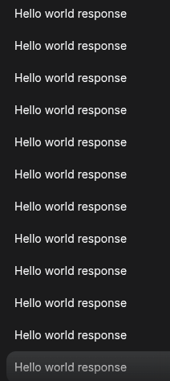
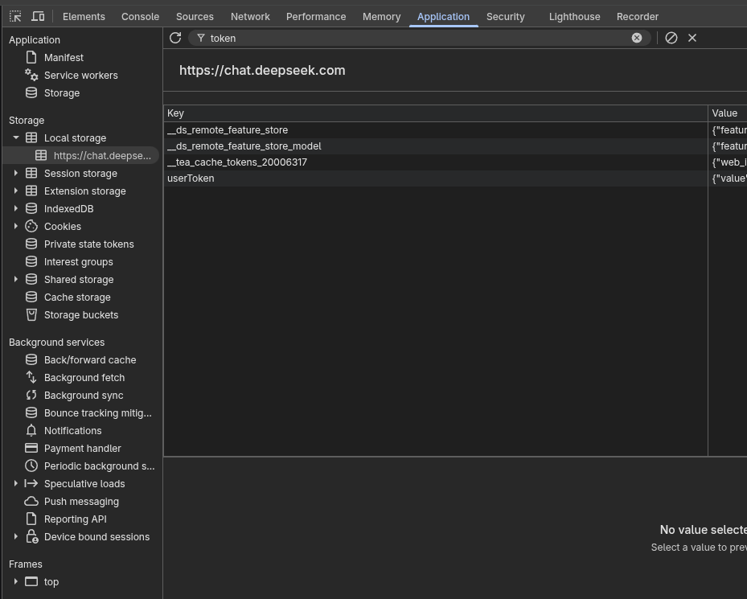

# DeepSeek Proxy

> **⚠️ 此仓库的旧 token 已失效，请勿再用它测试**  
> **⚠️ The old token in this repo has been revoked. Do NOT use it for testing.**
>
> 
>
> **🔑 如需测试，请登录自己的 DeepSeek 账号，按 F12 打开浏览器开发工具查找你的 Bearer Token**  
> **🔑 To test, log into your own DeepSeek account, press F12, and find your Bearer Token in DevTools.**
>
> 

DeepSeek 网页 API 反代，提供 OpenAI 兼容端点，可直接替代 OpenAI API base URL 使用。

无需 Electron，纯 Python 实现，支持 DeepSeek-V3.2（对话）和 DeepSeek-R1（推理）模型。

---

## 功能特性

- **OpenAI 兼容接口** — 适配 `/v1/chat/completions`、`/v1/models`、`/health`
- **双模型支持** — DeepSeek-V3.2（`deepseek-chat` / `deepseek-v3`）和 DeepSeek-R1（`deepseek-reasoner` / `deepseek-r1`）
- **双认证通道** — Password（邮箱/手机号 + 密码自动登录）或 Bearer Token
- **双会话策略** — REUSE（初始化创建 session 永久复用）或 NEW（每次请求新建 session）
- **PoW 反爬** — 自动下载 WASM 模块并求解工作量证明
- **流式响应** — Server-Sent Events 流式输出，支持 `reasoning_content`（R1 推理过程）
- **CORS 支持** — 跨域请求开箱即用

---

## 技术栈

| 组件 | 用途 |
|------|------|
| FastAPI | HTTP 服务器，路由与中间件 |
| httpx | 异步 HTTP 客户端，支持 SOCKS 代理 |
| uvicorn | ASGI 服务器 |
| pydantic | 数据模型与验证 |
| wasmtime | WebAssembly 运行时，执行 PoW WASM 模块 |

---

## API 端点

```
GET  /health             健康检查
GET  /v1/models          可用模型列表
POST /v1/chat/completions  对话补全（流式）
```

请求示例（OpenAI SDK）:

```python
from openai import OpenAI

client = OpenAI(
    api_key="any-token",
    base_url="http://127.0.0.1:5317/v1"  # 指向本服务
)

# DeepSeek-V3.2 对话
stream = client.chat.completions.create(
    model="deepseek-chat",
    messages=[{"role": "user", "content": "Hello"}],
    stream=True
)
for chunk in stream:
    print(chunk.choices[0].delta.content, end="")

# DeepSeek-R1 推理（输出包含 reasoning_content）
stream = client.chat.completions.create(
    model="deepseek-reasoner",
    messages=[{"role": "user", "content": "Why is the sky blue?"}],
    stream=True
)
```

curl 示例:

```bash
curl -X POST http://127.0.0.1:5317/v1/chat/completions \
  -H "Content-Type: application/json" \
  -d '{"model":"deepseek-chat","messages":[{"role":"user","content":"Say hi"}],"max_tokens":50}'
```

---

## 快速开始

### 环境要求

- Python 3.12+
- UV 包管理器（推荐）

### 安装

```bash
# 克隆
git clone https://github.com/MOSSVENC/chat2api_reborn.git
cd chat2api_reborn

# 使用 UV 安装依赖并运行
uv sync
uv run deepseek-proxy
```

服务将在 `http://127.0.0.1:5317` 启动。

### 全局安装（可选）

```bash
uv pip install -e .
deepseek-proxy
```

---

## 配置

编辑 `src/deepseek_proxy/config.py` 中的 `CONFIG` 对象：

```python
CONFIG = ProxyConfig(
    # 认证模式: TOKEN（默认）或 PASSWORD
    auth_mode=AuthMode.TOKEN,
    user_token="your-bearer-token-here",

    # PASSWORD 模式用这些字段
    # account_email="example@mail.com",
    # account_password="your-password",

    # 会话策略: REUSE 或 NEW
    session_mode=SessionMode.REUSE,

    # 服务器
    server_host="127.0.0.1",
    server_port=5317,
    api_tokens=[],  # 空 = 不鉴权，可填入 API Key 列表
)
```

### 配置参数说明

| 参数 | 默认值 | 说明 |
|------|--------|------|
| `auth_mode` | `TOKEN` | 认证方式 |
| `user_token` | — | Bearer Token（auth_mode=TOKEN 时） |
| `account_email` | — | 邮箱（auth_mode=PASSWORD 时） |
| `account_password` | — | 密码（auth_mode=PASSWORD 时） |
| `session_mode` | `REUSE` | REUSE 复用 session；NEW 每次新建 |
| `server_host` | `127.0.0.1` | 监听地址 |
| `server_port` | `5317` | 监听端口 |
| `api_tokens` | `[]` | API Key 鉴权列表，空=不鉴权 |
| `default_model` | `DEFAULT` | 默认模型 |
| `http_timeout` | `120.0` | HTTP 请求超时（秒） |

---

## 项目结构

```
src/deepseek_proxy/
├── __init__.py          模块入口，导出核心类型
├── config.py            配置定义与默认 CONFIG
├── client.py            DsClient HTTP 客户端
├── auth.py              双通道认证（密码 / Token）
├── pow_solver.py        PoW 求解（WASM + wasmtime）
├── sessions.py          会话管理（复用 / 新建策略）
├── prompt.py            ChatML prompt 构建
├── sse_parser.py        SSE 流解析 Pipeline
├── openai_adapter.py    OpenAI 请求 → DeepSeek 请求适配
├── server.py            FastAPI 服务器，定义所有端点
└── main.py              入口，asyncio 事件循环 + cli()
```

---

## 模型映射

| OpenAI 模型名 | DeepSeek 模型 | 类型 |
|--------------|--------------|------|
| `deepseek-chat` | `default` | V3.2 对话 |
| `deepseek-v3` | `default` | V3.2（别名）|
| `deepseek-reasoner` | `expert` | R1 推理 |
| `deepseek-r1` | `expert` | R1（别名）|

---

## 注意事项

- 本项目仅供学习和研究使用，请遵守 DeepSeek 服务条款
- Bearer Token 从浏览器开发者工具获取（登录 chat.deepseek.com 后）
- PoW 求解会消耗 CPU 资源，首次启动需要下载 WASM 文件
- 生产环境建议配置 API Key 鉴权 `api_tokens`
- REUSE 模式下 session 永久复用，适合长对话；NEW 模式适合独立请求

---

## License

MIT